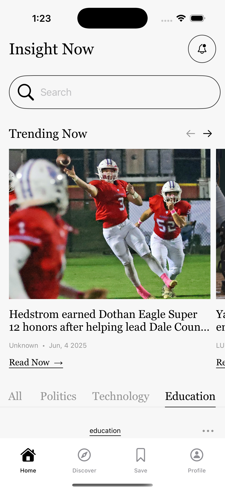
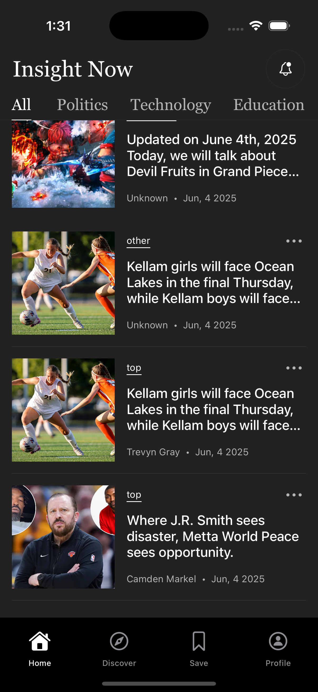
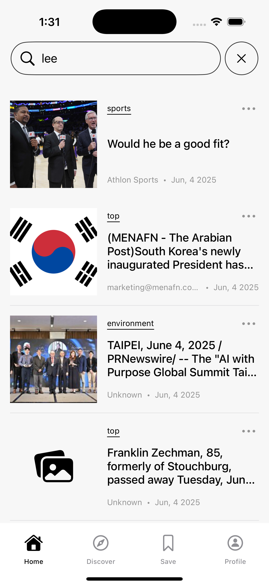
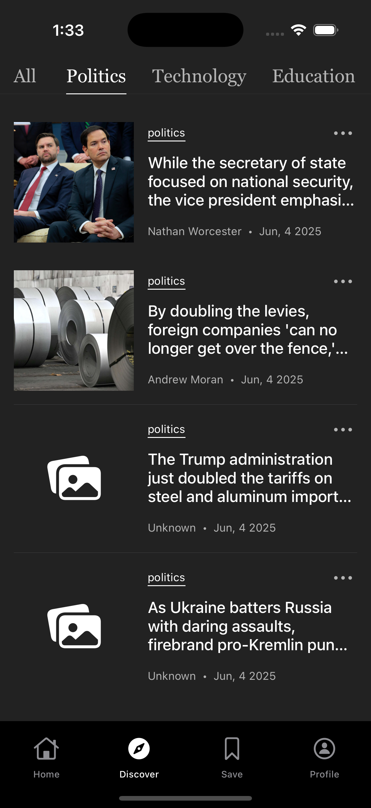
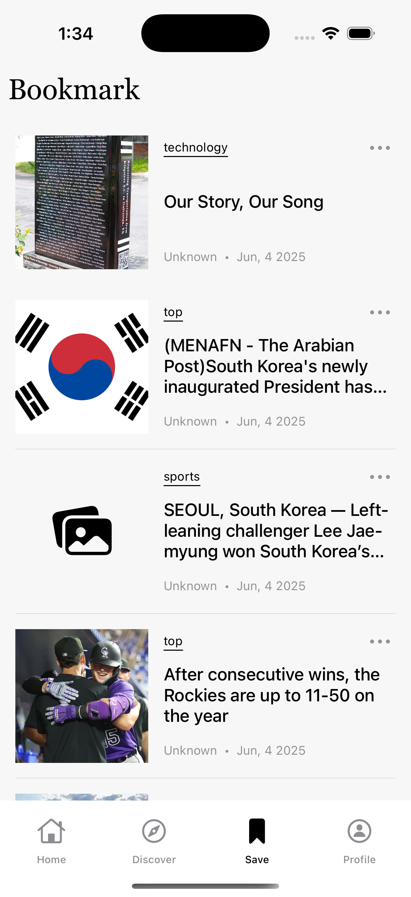

# News App

이 프로젝트는 iOS 스토리보드를 활용하여 개발된 뉴스 애플리케이션입니다. 사용자는 다양한 카테고리의 최신 뉴스를 확인하고, 관심 있는 기사를 북마크하며, 키워드로 뉴스를 검색할 수 있습니다. 

UIKit과 스토리보드 인터페이스 빌더를 중심으로 구성되어 있으며, 네트워크 통신, 페이징 처리, 사용자 인터랙션 등 기본적인 요소들을 학습하고 구현하는 데 중점을 두었습니다.

## 🌠 Images

|  이미지   |   이미지  |  이미지   |
| :-: | :-: | :-: |
|  |  |  |
|  |  |  |

